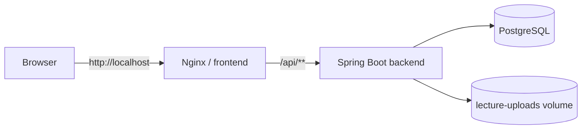

# Обзор развёртывания

## Назначение

Student Testing поставляется как клиент-серверное приложение из трёх основных runtime-компонентов: PostgreSQL, Spring Boot backend и Vue frontend, обслуживаемый Nginx.

## Канонический локальный сценарий

Для текущей версии проекта основным является Docker Compose:

```text
Docker Compose
├── postgres   PostgreSQL 16
├── backend    Spring Boot / Java 17
└── frontend   Nginx + Vue production build
```

Порядок запуска контролируется healthchecks:

```text
PostgreSQL healthy
        ↓
Backend starts
        ↓
Backend readiness healthy
        ↓
Frontend starts
```

Этот путь минимизирует требования к host-машине: Java, Maven, Node.js, npm, PostgreSQL и Nginx устанавливать отдельно не требуется.

## Поддерживаемые режимы

| Режим | Назначение | Состояние |
|---|---|---|
| Windows quick start | локальная демонстрация и разработка | основной поддерживаемый путь |
| Docker Compose вручную | локальная/тестовая среда | основной поддерживаемый путь |
| Backend + frontend отдельно | frontend/backend разработка | поддерживается с известными нюансами |
| Production | внешнее размещение | инфраструктурная основа есть, bootstrap требует доработки |

## Локальный Docker runtime



Backend также публикуется на `127.0.0.1` для диагностики и Swagger, но браузер frontend в штатном сценарии обращается к API через Nginx same-origin proxy.

## Почему Docker Compose считается каноническим

Он фиксирует:

- совместимую PostgreSQL 16;
- Java 17 runtime;
- Node 22 build environment;
- production frontend build;
- Nginx reverse proxy;
- persistent volumes;
- healthcheck-зависимости;
- одинаковый API prefix `/api/v1`;
- локальные секреты через `.env`.

## Что не следует смешивать

Локальная Docker-среда и production имеют разные требования. Текущий Compose включает настройки, удобные для разработки:

```text
SPRING_PROFILES_ACTIVE=local
SPRING_JPA_HIBERNATE_DDL_AUTO=update
SPRING_SQL_INIT_MODE=always
APP_DATA_LOADER_ENABLED=true
```

Они позволяют быстро поднять чистую локальную БД, но не должны автоматически переноситься в production. Подробнее см. [Production-развёртывание](./production-deployment.md) и [Ограничения развёртывания](./deployment-limitations.md).
