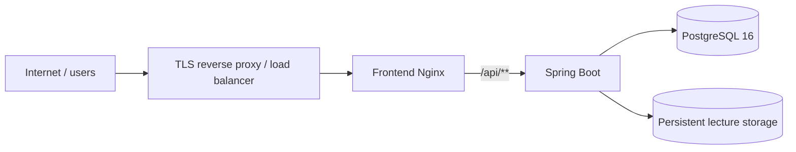

# Production-развёртывание

## Текущий статус

Dockerfile и Nginx дают хорошую базу для production-подобного запуска, но текущий `docker-compose.yml` следует рассматривать прежде всего как **single-host local/demo deployment**.

Полностью автоматизированного чистого production bootstrap сейчас нет.

## Целевая схема



## HTTPS

Текущий frontend Nginx слушает HTTP `80` и не содержит TLS certificates/configuration.

Для Internet-facing production рекомендуется TLS termination перед frontend container:

- reverse proxy;
- ingress controller;
- load balancer;
- иная управляемая инфраструктура.

## Production secrets

Не используйте локально сгенерированный `.env` как универсальный production secret store.

Минимально необходимо независимо выдать:

- сильный PostgreSQL password;
- уникальный JWT signing secret;
- TLS secrets;
- при необходимости credentials внешних инфраструктурных компонентов.

## DataLoader

Production должен использовать:

```text
APP_DATA_LOADER_ENABLED=false
```

поскольку текущий DataLoader содержит известные демонстрационные аккаунты.

## Database schema

Для production желательно:

```text
SPRING_JPA_HIBERNATE_DDL_AUTO=validate
SPRING_SQL_INIT_MODE=never
```

Но перед этим проекту нужен надёжный внешний mechanism создания/миграции schema. Сейчас Flyway/Liquibase отсутствует.

## Initial administrator

Нужен отдельный безопасный provisioning mechanism для первого администратора. Публичная регистрация не решает эту задачу.

## Persistent storage

Production должен отдельно защищать:

```text
PostgreSQL
lecture materials
```

Оба набора данных должны входить в backup/restore procedure.

## PostgreSQL

При внешней managed DB нужно обеспечить extension `citext` и права приложения. Рекомендуется не предоставлять приложению избыточные administrative DB privileges после bootstrap.

## Scalability

Текущий Compose использует fixed `container_name` и один экземпляр каждого сервиса. Для горизонтального масштабирования, rolling updates и HA потребуется иная orchestration configuration.

## Production checklist до публикации

Перед внешним развёртыванием необходимо как минимум:

1. отключить demo DataLoader;
2. внедрить database migration/bootstrap strategy;
3. создать secure initial-admin provisioning;
4. исправить известные schema inconsistencies;
5. настроить HTTPS;
6. определить backup PostgreSQL + lecture files;
7. определить log rotation/monitoring;
8. задать resource limits;
9. использовать versioned image tags;
10. проверить security configuration и CORS для реального домена.
