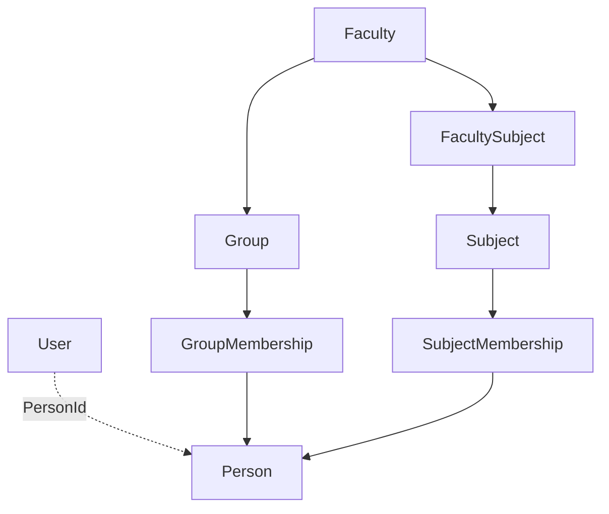

# Академическая модель

## Назначение

Академический домен описывает организационную структуру, в которой затем создаются учебная нагрузка, лекции и тестовые назначения.

## Основные сущности

### `Faculty`

Факультет/подразделение. Используется как верхнеуровневый академический справочник и связывается с группами и предметами.

### `Group`

Учебная группа. Группа относится к факультету и содержит membership студентов.

### `Subject`

Учебный предмет. Может связываться с факультетами и преподавателями.

### `Person`

Человек в академической модели. Не следует путать с `User` — учётной записью системы.

## Membership как самостоятельная сущность

### `GroupMembership`

Связывает Person и Group и содержит:

- роль в membership;
- статус;
- `AssignedAtUtc`;
- `RemovedAtUtc`;
- notes.

### `SubjectMembership`

Связывает Person и Subject и также содержит роль, статус, время назначения/снятия и notes.

Для преподавателя `SubjectMembership` служит важной точкой привязки последующей учебной нагрузки и контента.

## Связи факультета и предмета

`FacultySubject` описывает связь факультета с предметом. Это отдельный управляемый контекст, а не вычисляемая связь через группы.

## Почему membership не удаляется безусловно

Использование статуса и `RemovedAtUtc` позволяет сохранять историю назначения. В UI это проявляется возможностью восстановить ранее снятого студента или повторно активировать связь вместо создания логически новой записи во всех случаях.

## Зависимости домена

## Роль администратора

Администратор формирует базовую структуру: факультеты, группы, предметы, membership и связи. Без этого преподавательский и студенческий сценарии не имеют корректного академического контекста.

## Граница с teaching domain

Академическая модель отвечает на вопросы:

- кто является студентом/преподавателем в конкретной связи;
- в какой группе находится студент;
- какой преподаватель связан с предметом.

Teaching domain добавляет учебный период, группу преподавания, тип нагрузки, часы и конкретные enrollment.
