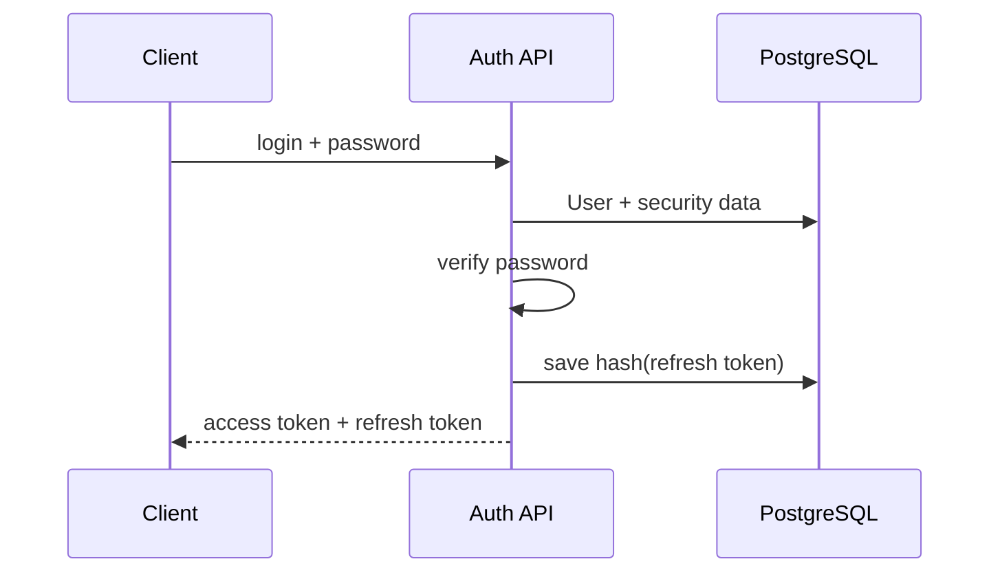
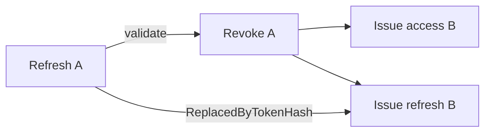

# Аутентификация

## Общая модель

API использует stateless authentication на основе пары:

- короткоживущий JWT access token;
- более долгоживущий refresh token.



## Login

При входе `UserRegisterService`:

1. нормализует login;
2. загружает активного пользователя;
3. проверяет password hash;
4. при необходимости обновляет устаревший формат хэша;
5. формирует access/refresh пару;
6. сохраняет серверную запись refresh token.

## Пароли

`DotNetPasswordHasher` сохраняет совместимость с ASP.NET Identity форматами и использует для новых hash:

- PBKDF2;
- HMAC-SHA512;
- 100 000 итераций;
- 16-byte salt;
- 32-byte subkey.

Поддерживается проверка legacy-форматов:

- ASP.NET Identity V2/V3-подобные PBKDF2 hash;
- BCrypt (`$2a$`, `$2b$`, `$2y$`).

Если старый hash успешно проверен, сервис может перехэшировать пароль в актуальный формат.

## Access token

Access token передаётся в:

```http
Authorization: Bearer <token>
```

`JwtAuthenticationFilter` восстанавливает Authentication для запроса. API работает со `SessionCreationPolicy.STATELESS` и не использует серверную HTTP session как источник аутентификации.

## Refresh token

Клиент получает исходный refresh token, но backend хранит не его значение, а SHA-256 hash.

`RefreshToken` также содержит:

- `UserId`;
- lifetime kind;
- время создания и истечения;
- IP и User-Agent создания;
- время/IP отзыва;
- hash токена, которым он был заменён.

## Ротация refresh token

При успешном refresh:



Старый refresh token помечается revoked, новый сохраняется отдельной записью.

Повторное использование уже отозванного refresh token отклоняется.

## Смена пароля

После успешной смены пароля backend:

1. обновляет password hash;
2. отзывает все активные refresh token пользователя.

Frontend после этого очищает локальную сессию и требует повторной аутентификации.

## Logout

Frontend очищает локальную сессию немедленно. Revoke refresh token на backend выполняется best-effort. Даже если revoke-запрос не дошёл до сервера, очищенная клиентская сессия не восстанавливается автоматически.

## Регистрация

Публичная регистрация управляется конфигурацией `app.registration.public-enabled`.

Новый публичный пользователь создаётся без `PersonId`, потому что клиент не может доказать владение уже существующей записью Person. Привязку выполняет администратор.

## Хранение токенов на frontend

Текущий Pinia auth store сохраняет access/refresh token через persisted state. Это обеспечивает восстановление сессии после перезагрузки страницы, но refresh token остаётся доступен JavaScript. Ограничение и возможный переход на HttpOnly cookie описаны в [technical-limitations.md](./technical-limitations.md).
