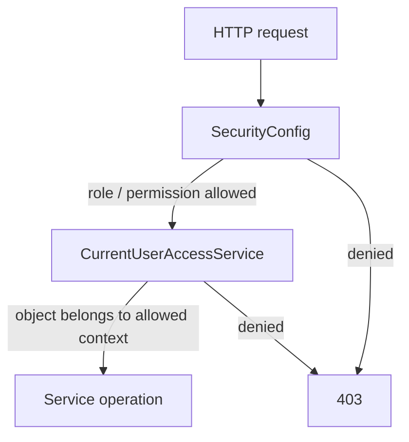

# Авторизация и контроль доступа

## Два уровня авторизации

В Student Testing авторизация не ограничивается проверкой роли на маршруте.



### Уровень 1: HTTP authorization

`SecurityConfig` задаёт правила для endpoint-групп. Используются как роли, так и permissions.

Примеры authority:

- `ROLE_ADMIN` / `ADMIN`;
- `ROLE_TEACHER` / `TEACHER`;
- `users.read`, `users.write`;
- `roles.manage`;
- `people.read`, `people.write`;
- `academic.manage`;
- `courses.manage`;
- `teaching.manage`;
- `tests.manage`;
- `questions.manage`.

Публичными остаются endpoint'ы login/register/refresh/status. `/api/v1/public/learning/**` требует аутентификацию, несмотря на слово `public`: это публичный с точки зрения роли Student учебный API, а не anonymous API.

### Уровень 2: object-level authorization

`CurrentUserAccessService` проверяет, имеет ли текущий пользователь право работать именно с переданным объектом.

Для администратора многие object-level проверки завершаются сразу. Для преподавателя может проверяться принадлежность:

- subject membership;
- teaching assignment;
- topic;
- question;
- option;
- test;
- lecture;
- course template/version;
- group/context.

Это предотвращает сценарий, при котором преподаватель имеет общий permission `tests.manage`, но пытается изменять тест другого преподавателя.

## Роли и permissions

Модель поддерживает одновременно:

```text
User -> UserRole -> Role -> RolePermission -> Permission
User -> UserPermission -> Permission
```

То есть effective permissions могут приходить:

1. через роль;
2. напрямую пользователю.

Backend при формировании `UserDetails` нормализует authority и добавляет `ROLE_<NAME>` для ролей.

## Workspace role на frontend

Frontend различает `role` и активный рабочий режим. Многоролевый пользователь может иметь, например, `TEACHER + ADMIN`, но интерфейс в конкретный момент работает в одном `workspaceRole`.

Важно: `workspaceRole` — UI-контекст, а не замена backend authorization. Запрос всё равно проверяется сервером по реальным authorities и доменному доступу.

## `PersonId` как условие доменного доступа

Для части учебных сценариев недостаточно существования `User`. Нужен связанный `Person`, потому что предметные связи (группы, предметы, попытки) строятся вокруг Person.

Поэтому frontend отправляет учётную запись без готового доменного профиля на `account-pending`.

## Принцип fail closed

Если frontend не может восстановить валидную security context, запросы не должны продолжаться как авторизованные. Auth store очищает сессию при истёкших/некорректных credentials и не переносит ответы старой сессии в новую.
