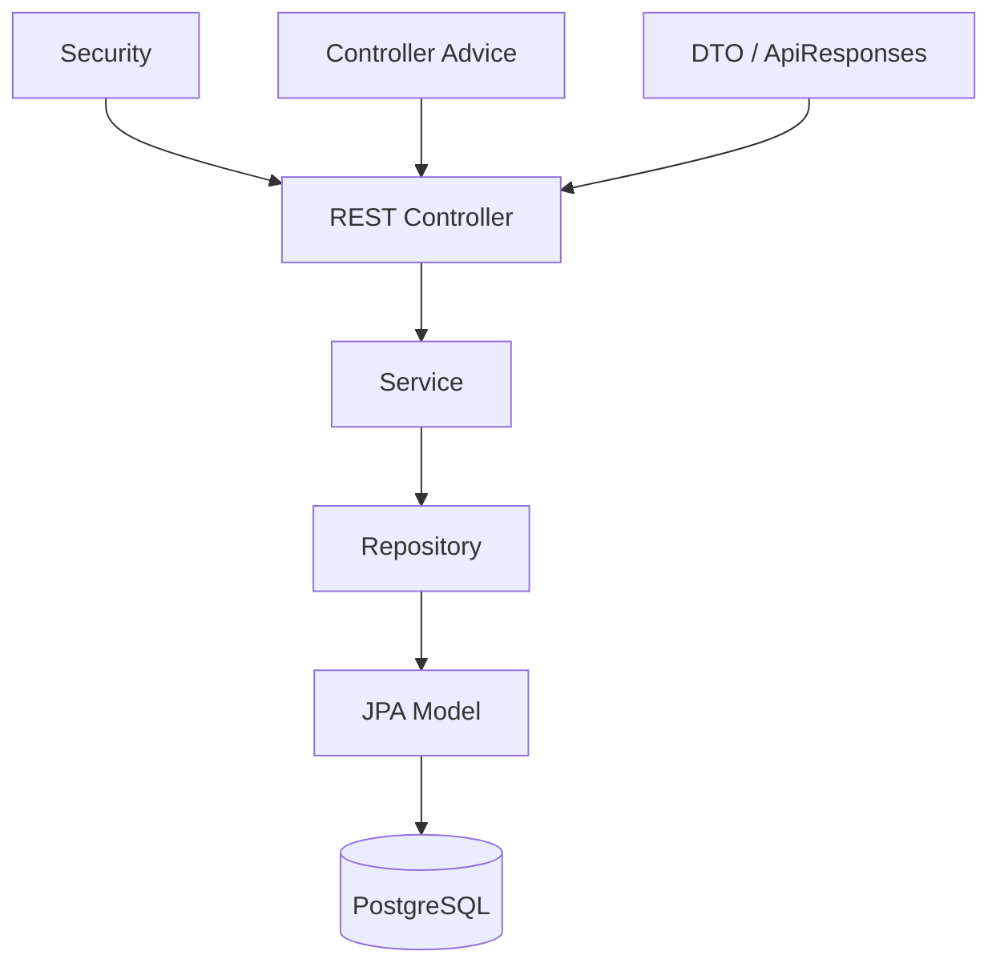

# Архитектура backend

## Общая структура

Backend расположен в `backend/` и построен на Spring Boot 3.4.3 / Java 17.

Основные пакеты:

```text
org.santayn.testing
├── config
├── models
├── repository
├── security
├── service
└── web
    ├── advice
    ├── controller
    └── dto
```

## Слои



### REST controller

Контроллеры находятся в `web/controller/rest`. Их задача:

- принять HTTP-запрос;
- выполнить первичную валидацию payload;
- получить текущего `Authentication`;
- вызвать проверку доступа к ресурсу, если она относится к конкретному объекту;
- передать бизнес-операцию сервису;
- преобразовать результат в DTO/response-модель.

В проекте выделены контроллеры для авторизации, пользователей, ролей, факультетов, групп, предметов, memberships, учебной нагрузки, курсов, лекций, вопросов, тестов, результатов, публичного учебного сценария и резервного копирования.

### Service

Сервисный слой содержит основную бизнес-логику. К ключевым сервисам относятся:

- `UserRegisterService` — вход, регистрация, refresh/revoke, смена пароля;
- `CurrentUserAccessService` — object-level authorization;
- `TeachingService` — учебные назначения и enrollment;
- `CourseService` — шаблоны и версии курсов;
- `LectureService` / `LectureMaterialService` / `LectureTestLinkService`;
- `QuestionService` / `QuestionDocxImportParser`;
- `TestService` — тесты, назначения, попытки, выбор вопросов и оценивание;
- `DatabaseBackupService` — dump/restore PostgreSQL;
- реализации `TextAnswerEvaluationService`.

Операции изменения данных обычно выполняются внутри `@Transactional`, а read-only сценарии используют `@Transactional(readOnly = true)`.

### Repository

Репозитории построены на Spring Data JPA. Помимо обычных CRUD-запросов используются:

- выборки с загрузкой security-связей;
- запросы по текущему Person/Subject/Group;
- подсчёт попыток;
- выбор активных вопросов;
- pessimistic locking для критичных операций начала попытки.

### Models

`models` разделены по доменным пакетам: `user`, `person`, `role`, `faculty`, `group`, `subject`, `teacher`, `course`, `lecture`, `topic`, `question`, `test`.

Это физическое деление не всегда совпадает с пользовательским сценарием. Например, жизненный цикл тестирования связывает сущности из `test` и `question` одновременно.

## DTO и внешняя модель

JPA-сущность не должна рассматриваться как публичный API-контракт. REST-контроллеры используют response/request модели и сборку DTO. Это снижает связанность API с внутренней ORM-моделью и позволяет:

- скрывать служебные поля;
- не сериализовать lazy-связи напрямую;
- контролировать структуру ответа;
- отдавать только разрешённые данные.

## `open-in-view=false`

В `application.yml` установлено:

```yaml
spring:
  jpa:
    open-in-view: false
```

Следствие: необходимые связи должны быть получены внутри сервисной транзакции. Контроллер не должен рассчитывать на ленивую загрузку сущностей после выхода из service layer.

## Security как отдельный слой

Backend использует:

- `SecurityConfig` для HTTP authorization;
- `JwtAuthenticationFilter` для восстановления security context из access token;
- `JwtService` для выпуска и проверки токенов;
- `CurrentUserAccessService` для проверки владения/доступности конкретного доменного объекта;
- `DotNetPasswordHasher` для паролей.

Детали описаны в [аутентификации](./authentication.md) и [авторизации](./authorization.md).

## Ошибки

Контроллеры не должны самостоятельно формировать произвольные форматы ошибок. Централизованный advice приводит исключения к общей HTTP-модели ошибки с кодом, сообщением, деталями и `traceId`.

## Внешние системные зависимости backend

Кроме PostgreSQL backend использует:

- файловую систему для материалов лекций;
- `pg_dump` и `psql` для backup/restore;
- Apache POI для импорта `.docx`;
- опциональный локальный HTTP LLM endpoint.

## Граница ответственности backend

Backend является источником истины для:

- личности и security context;
- ролей и permissions;
- академической структуры;
- доступности ресурсов;
- создания и продолжения тестовой попытки;
- состава вопросов конкретной попытки;
- проверки ответов и начисления баллов;
- результатов.

Frontend может предварительно проверять эти условия, но backend обязан проверять их независимо.
