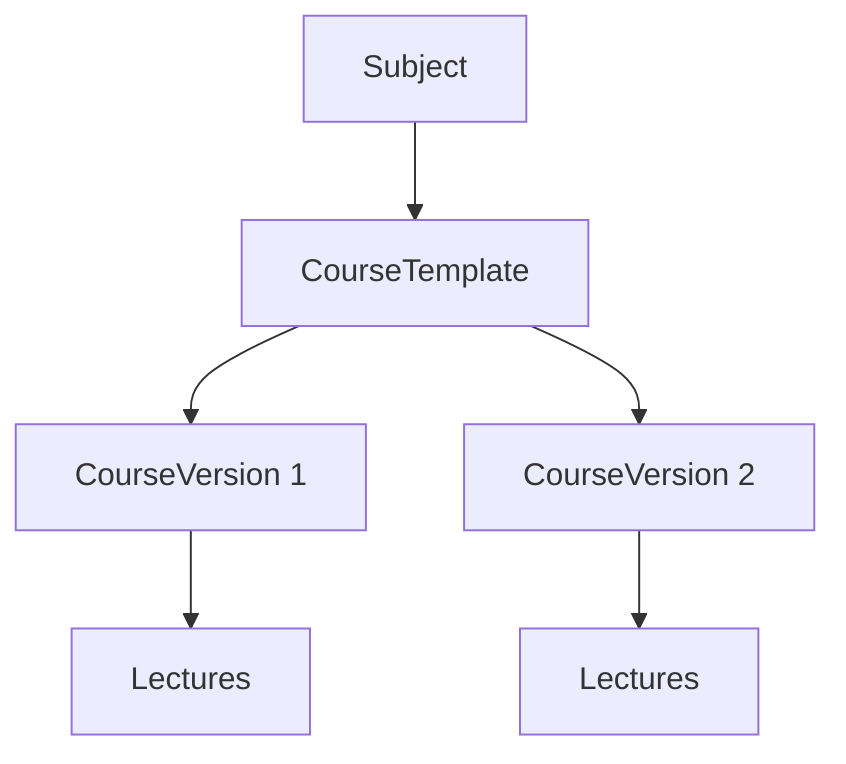

# Курсы, лекции и учебный контент

## Шаблон и версия курса

Проект разделяет постоянную идентичность курса и его версии.

### `CourseTemplate`

Хранит:

- `SubjectId`;
- `AuthorPersonId`;
- name;
- public visibility;
- created timestamp.

### `CourseVersion`

Хранит:

- номер версии;
- title/description;
- publication flag;
- creator;
- publisher и время публикации;
- change notes.

Версионирование позволяет создавать новую редакцию курса без перезаписи смысловой истории предыдущей версии.

## Лекции

`Lecture` (`CourseLectures`) может быть связана с:

- Subject;
- SubjectMembership преподавателя;
- CourseVersion;
- ordinal;
- title и description;
- content folder key;
- linked test;
- publication flag.

Порядок лекций хранится явно через `Ordinal` и поддерживается индексами уникальности в relevant context.

## Темы

`Topic` служит контекстом банка вопросов и может использоваться правилами выбора вопросов теста. Темы упорядочиваются и принадлежат предметному/преподавательскому контексту.

## Связь лекции и теста

В текущей модели одновременно присутствуют два механизма:

1. legacy/compatibility поле `Lecture.LinkedTestId`;
2. таблица `LectureTestLinks`, позволяющая связывать одну лекцию с несколькими тестами.

`schema.sql` содержит перенос/синхронизацию существующих связей в link-таблицу. Это переходная модель и она отдельно отмечена в [technical-limitations.md](./technical-limitations.md).

## Материалы лекции

`LectureMaterial` хранит метаданные материала, а файл лежит во внешнем файловом хранилище. Детали — в [file-storage-and-import.md](./file-storage-and-import.md).

## Публикация

Лекция имеет `IsPublic`; версия курса — `IsPublished`; шаблон — `IsPublic`. Эти признаки отвечают за разные уровни видимости и не являются взаимозаменяемыми.

## Авторство и domain ownership

Контент связан с Person/SubjectMembership. Это используется не только для отображения автора, но и для object-level authorization преподавателя.
