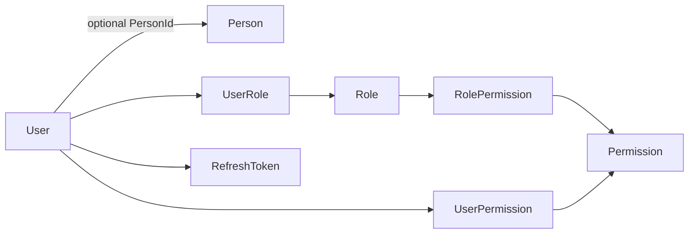
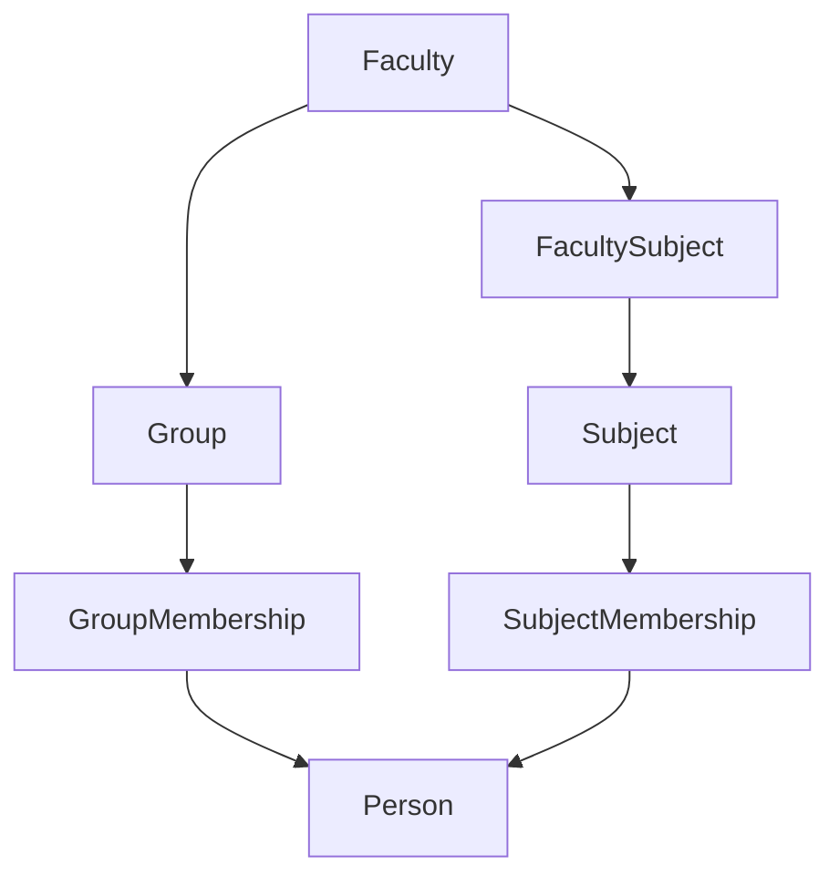
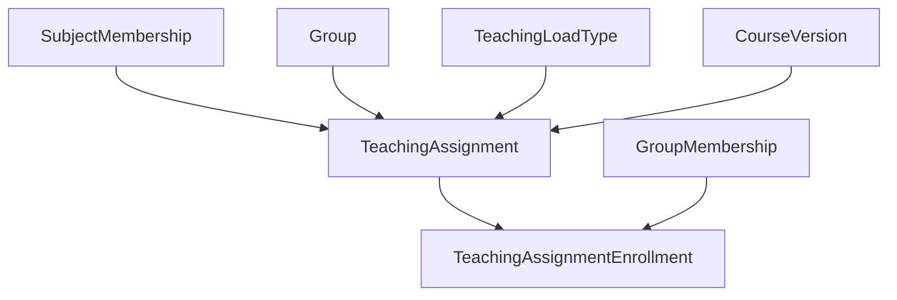
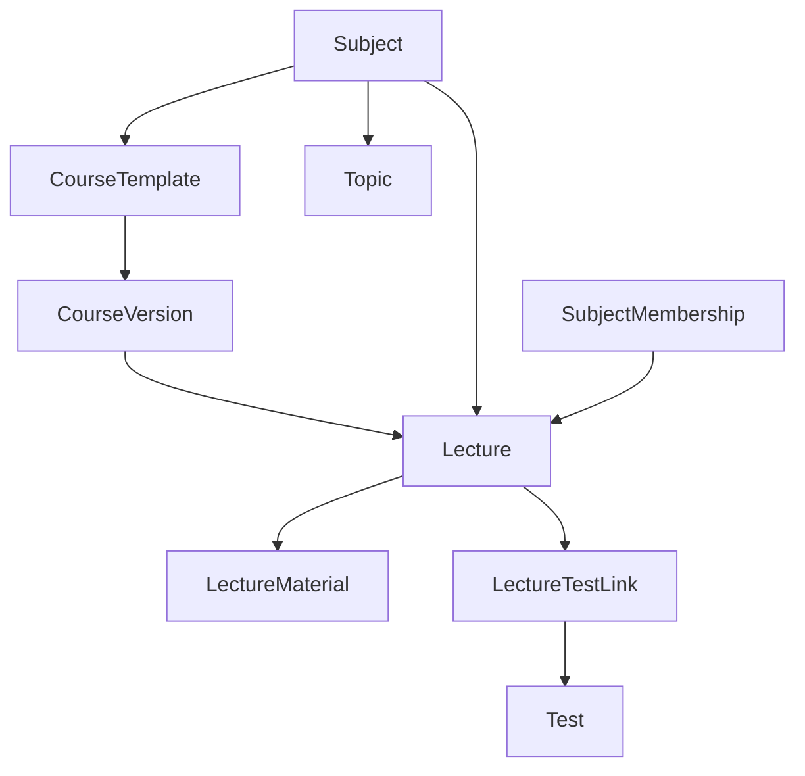
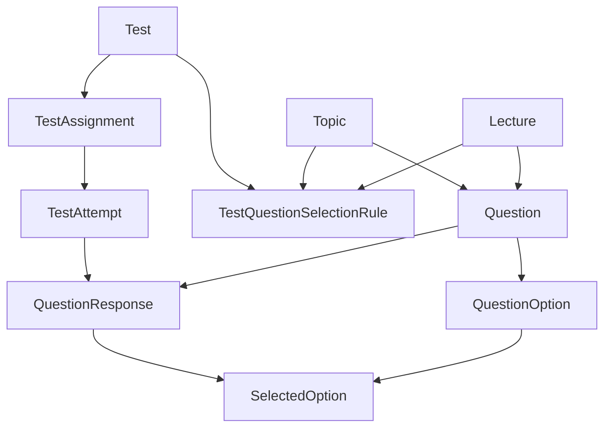

# Модель данных

## Общий принцип

Модель данных Student Testing разделяет четыре крупных области:

1. учётные записи и безопасность;
2. академическую структуру;
3. учебный контент и нагрузку;
4. тестирование и результаты.

В backend модели представлены JPA-сущностями в `org.santayn.testing.models`.

## Учётная запись и человек

Ключевое разделение:

`User` отвечает за authentication/security:

- login;
- password hash;
- active state;
- roles;
- direct permissions;
- optional `PersonId`.

`Person` отвечает за сведения о человеке в академической модели:

- имя и фамилия;
- дата рождения;
- email;
- телефон.

Это позволяет существовать учётной записи, которая ещё не привязана к академическому профилю.

## Академическая структура

`GroupMembership` и `SubjectMembership` являются самостоятельными сущностями, а не только join-таблицами. Они содержат статус, время назначения/удаления и примечания.

## Учебная нагрузка

`TeachingAssignment` описывает назначение преподавателя/предмета на группу в конкретном учебном периоде с типом нагрузки и часами.

`TeachingAssignmentEnrollment` связывает конкретный membership студента с учебным назначением.

## Курсы и лекции

`CourseTemplate` задаёт логический шаблон курса. `CourseVersion` хранит версию с номером, описанием изменений и состоянием публикации. Лекции могут относиться к конкретной версии.

## Вопросы, тесты и результаты

### `Test`

Хранит описание теста, количество вопросов, число разрешённых попыток, продолжительность и автора.

### `TestQuestionSelectionRule`

Определяет, из какого контекста и в каком количестве выбирать вопросы, включая количество вопросов каждого типа.

### `TestAssignment`

Связывает тест с учебным контекстом и временным окном доступности. Может быть связан с версией курса, лекцией и/или `TeachingAssignment`.

### `TestAttempt`

Конкретная попытка Person по TestAssignment. Содержит ordinal, статус, время начала/завершения и итоговый score.

### `QuestionResponse`

Ответ на конкретный вопрос внутри попытки. В нём сохраняются текст ответа, корректность и начисленные баллы.

### `SelectedOption`

Фиксирует выбранные варианты ответа для option-based вопросов.

## Важная семантика модели

- `Test` не равен `TestAssignment`: тест описывает содержание и правила, assignment — кому и когда он доступен.
- `TestAttempt` не равен результату как отдельной сущности: итоговый результат собирается из попытки и `QuestionResponse`.
- `User` не равен `Person`.
- Membership-сущности сохраняют контекст назначения и позволяют моделировать жизненный цикл связи.
- Бинарное содержимое материалов лекций не хранится в БД; в БД находятся метаданные и путь.
