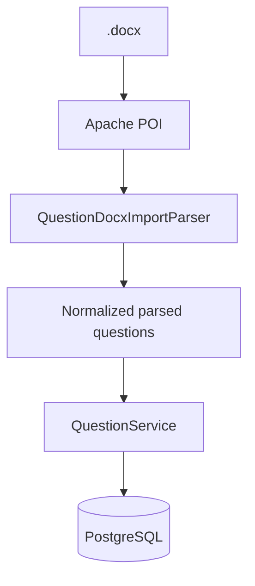

# Хранение файлов и импорт

## Материалы лекций

Бинарные материалы не хранятся в PostgreSQL. БД содержит `LectureMaterial` с метаданными, а физический файл находится в директории, определяемой:

```text
APP_STORAGE_LECTURE_MATERIALS_DIR
```

Значение по умолчанию:

```text
uploads/lecture-materials
```

В Docker используется:

```text
/app/uploads/lecture-materials
```

и отдельный volume `lecture-uploads`.

## Организация хранения

Файлы группируются по лекции, а фактическое имя формируется безопасным способом с UUID/служебным ключом вместо слепого использования оригинального пользовательского имени.

Оригинальное имя сохраняется как метаданные для отображения/скачивания.

## Безопасность путей

`LectureMaterialService` нормализует путь и не должен позволять пользовательскому имени файла выйти за пределы configured storage directory. Это защищает от path traversal (`../...`).

## Ограничения multipart

По умолчанию backend настроен на:

```text
max file size    = 50 MB
max request size = 200 MB
```

Nginx также допускает request body до `200m`.

## Backup

Lecture files не входят в SQL dump PostgreSQL. Поэтому резервное копирование БД само по себе не является полным backup системы.

Полный backup:

```text
PostgreSQL dump
+
lecture-uploads volume
```

## DOCX import вопросов

Для импорта используется Apache POI и `QuestionDocxImportParser`.



Parser распознаёт структуру документа, тип вопроса, варианты, правильные ответы и matching-пары.

Поддерживаются четыре доменных типа вопросов: single, multiple, matching, text.

## Почему import parser отделён от service

Разделение позволяет:

- тестировать parsing без БД;
- не смешивать формат документа с CRUD вопросов;
- валидировать импорт до сохранения;
- при необходимости добавить другие форматы импорта через отдельные адаптеры.

## CSV dependency

В backend присутствует OpenCSV dependency, однако ключевой текущий пользовательский импорт вопросов реализован для `.docx`. Наличие библиотеки не следует документировать как гарантированный пользовательский CSV-сценарий без отдельного подтверждённого endpoint/UI.
