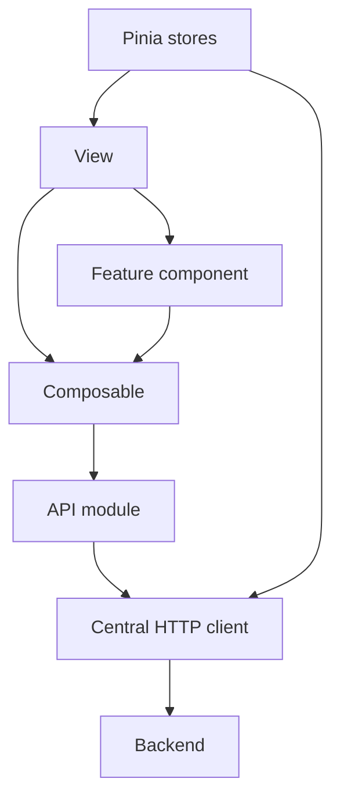

# Архитектура frontend

## Общая характеристика

Frontend расположен в `frontend/` и представляет собой Vue 3 SPA, собираемое Vite.

Основные зависимости:

- Vue 3.5;
- Vue Router 5;
- Pinia 4;
- Axios;
- PrimeVue 4.5;
- Tailwind CSS 4;
- Vitest и Vue Test Utils для тестирования.

## Структура `src`

```text
src/
├── api/
├── components/
│   ├── admin/
│   ├── layout/
│   ├── lectures/
│   ├── questions/
│   ├── results/
│   ├── subjects/
│   ├── teacher/
│   ├── tests/
│   └── ui/
├── composables/
├── config/
├── layouts/
├── navigation/
├── router/
├── stores/
├── theme/
├── utils/
└── views/
```

## Основной поток UI



### `views`

`views` — страницы, привязанные к маршрутам. Здесь собирается пользовательский сценарий, но тяжёлая повторно используемая логика по возможности выносится в composables и feature-компоненты.

### `components`

Компоненты делятся на предметные и общие. Отдельно выделен `components/ui`, который формирует внутренний UI API проекта.

### `composables`

Composables содержат состояние и оркестрацию конкретных feature-сценариев: административные справочники, тесты, лекции, вопросы, результаты, профиль, преподавательский контекст и т. д.

Это позволяет не превращать страницы в монолитные компоненты с сетевой и бизнес-логикой.

### `api`

API-модули группируют backend-вызовы по предметной области. Все авторизованные запросы проходят через общий HTTP client из `api/http.js`.

### `stores`

Глобальное состояние используется только для данных, которые действительно нужны всему приложению. Ключевой store — `auth`; также есть состояние темы.

Состояние конкретного экрана преимущественно остаётся в composable соответствующего feature.

## UI abstraction layer

Проект не полагается на прямое использование PrimeVue во всех страницах. В `components/ui` определён собственный набор компонентов вида:

```text
UiButton
UiInput
UiSelect
UiDialog
UiDrawer
UiTable
UiAlert
UiToastHost
...
```

Назначение слоя:

- единое оформление;
- централизованная dark/light theme интеграция;
- одинаковые размеры control/touch targets;
- возможность заменить внутреннюю UI-библиотеку без переписывания всех feature-компонентов;
- стандартизация accessibility-поведения.

## Маршрутизация и рабочие пространства

Router различает публичные и защищённые маршруты, а также рабочие пространства:

- `STUDENT`;
- `TEACHER`;
- `ADMIN`.

Многоролевый пользователь выбирает активный `workspaceRole`. Наличие роли само по себе не всегда достаточно: рабочие страницы могут требовать связанный `personId` и доменные назначения.

## Темы

Тема интерфейса поддерживает светлый/тёмный режим и синхронизируется с PrimeVue. Стилевые токены проекта применяются к layout и `Ui*` компонентам.

## Адаптивность и accessibility

В текущей реализации присутствуют:

- responsive sidebar;
- мобильный drawer;
- focus trap и восстановление фокуса;
- ARIA-атрибуты;
- touch targets для мобильных устройств;
- учёт `prefers-reduced-motion`;
- responsive формы и таблицы.

## Архитектурная граница

Frontend может хранить временное состояние и выполнять компенсирующие действия, но не должен самостоятельно считать себя источником истины по security и результатам теста.

Пример: локальный черновик ответов восстанавливает UX после навигации, но активная попытка и её итоговое состояние определяются backend.
