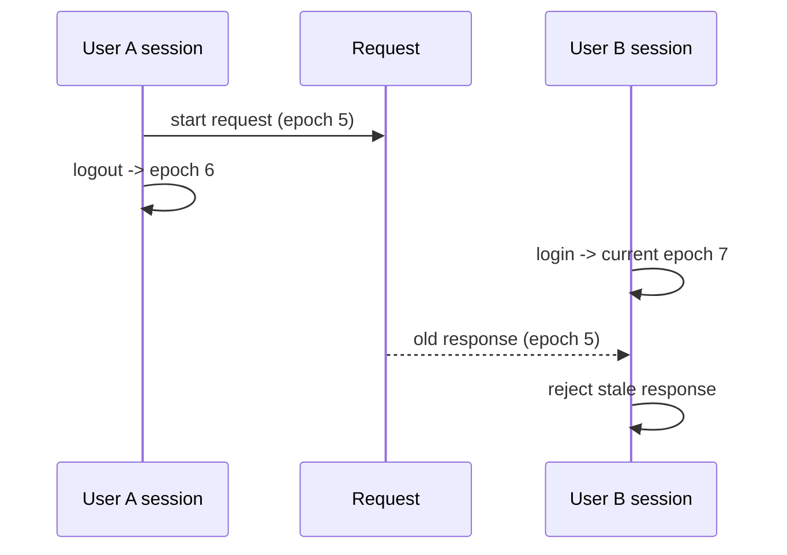

# Состояние frontend и жизненный цикл сессии

## Pinia

Глобальное состояние приложения намеренно ограничено. Основной auth store содержит:

- access/refresh token и сроки действия;
- текущего пользователя;
- роли и permissions через user payload;
- активную workspace role;
- runtime `sessionEpoch`;
- флаги auth-операций и ошибки.

Тема интерфейса хранится отдельно.

Состояние конкретных страниц преимущественно находится в composables.

## Persisted auth state

Через `pinia-plugin-persistedstate` сохраняются:

- token type;
- access token и expiration;
- refresh token и expiration;
- lifetime kind;
- user;
- active workspace role.

`sessionEpoch` намеренно **не сохраняется** и действует только в текущем runtime вкладки.

## Восстановление сессии

При bootstrap `auth.init()`:

1. проверяет наличие сохранённых credentials;
2. при отсутствующем/истекающем access token выполняет refresh;
3. вызывает `/auth/me` для получения актуальной идентичности;
4. при невалидной сессии очищает локальные данные.

Текущая последовательность может приводить к `refresh -> me`; возможность сокращения startup waterfall относится к дальнейшей оптимизации.

## `sessionEpoch`

Каждая явная смена security context увеличивает runtime-счётчик:

```text
login/logout/clear session
        ↓
sessionEpoch += 1
```

Асинхронная операция запоминает epoch, в котором была начата, и не может применить результат после смены сессии.

Пример:



Это защищает от утечки состояния между аккаунтами в одной вкладке.

## Рабочая роль

Если пользователь имеет несколько ролей, frontend вычисляет доступные workspace roles и сохраняет активную роль.

Переключение workspace role инвалидирует кэш учебного контекста, поскольку набор доступных данных может измениться.

## Learning context cache

Проект использует memory-only cache для повторно используемого учебного контекста.

Кэш:

- имеет TTL;
- учитывает security context;
- не является persistent storage;
- инвалидируется после релевантных mutation;
- сбрасывается при смене пользователя/Person/workspace role.

## Черновик тестовой попытки

Ответы во время прохождения теста сохраняются в `sessionStorage`.

Ключ/валидация черновика учитывают:

- `testId`;
- `assignmentId`;
- `attemptId`;
- fingerprint набора вопросов.

Это предотвращает восстановление ответов не в ту попытку после изменения контекста.

Черновик — только UX-механизм. Источником истины о том, существует ли активная попытка и завершена ли она, остаётся backend.
