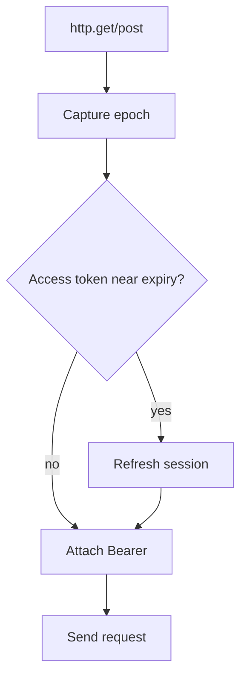
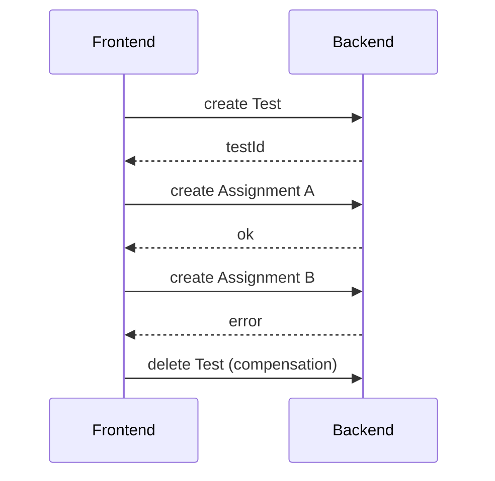

# Жизненный цикл HTTP-запросов и устойчивость

## Два Axios client

В `frontend/src/api/http.js` существуют:

- `authHttp` — без auth interceptors, для login/register/refresh/revoke;
- основной `http` — для авторизованных доменных запросов.

Разделение необходимо, чтобы refresh-запрос сам не попадал в обработчик `401` и не создавал рекурсивный цикл.

## Синхронная фиксация epoch

Перед фактической отправкой каждый `http.*` вызов фиксирует `_authSessionEpoch`.

Причина: async request interceptor может начать выполняться уже после logout/login. Фиксация на публичной границе запроса сохраняет исходный security context.

## Preflight refresh

Перед отправкой запроса interceptor проверяет access token. Если он скоро истечёт, auth store может обновить его **до** сетевой отправки.



## Single-flight refresh

Auth store хранит общую `refreshOperation`. Если несколько параллельных запросов одновременно требуют refresh в одной epoch, они используют одну network operation вместо нескольких ротаций refresh token.

Это особенно важно, потому что refresh token ротируется и повторное использование предыдущего токена будет отвергнуто backend.

## Retry после 401

Response interceptor:

1. реагирует только на первый `401`;
2. проверяет, что request epoch ещё актуален;
3. выполняет refresh, если другой запрос ещё не обновил token;
4. подставляет новый access token;
5. повторяет исходный запрос один раз.

Флаг `_authRetry` предотвращает бесконечный retry loop.

## Stale request protection

Если epoch изменился:

- запрос может быть остановлен до отправки;
- результат refresh не применяется;
- повтор после 401 не выполняется;
- старая ошибка не должна инвалидировать уже новую сессию.

## AbortController и latest-request guards

В feature-composables, особенно каскадных фильтрах результатов, используются отмена предыдущих запросов и проверка актуальности последнего запроса.

Это решает типовую гонку:

```text
фильтр A -> медленный request
фильтр B -> быстрый request
response B приходит первым
response A приходит позже
```

Без guard интерфейс мог бы показать данные A после того, как пользователь уже выбрал B.

## Инвалидация кэша после write

Успешные `POST/PUT/PATCH/DELETE` на релевантных академических endpoint'ах инвалидируют общие learning-context snapshots.

Неуспешная mutation не сбрасывает кэш, поскольку серверное состояние не изменилось.

## Saga-подобный сценарий создания теста

Frontend создаёт Test и затем несколько TestAssignment отдельными запросами. Если создание assignment завершается ошибкой, выполняется компенсирующее удаление созданного Test.



Это не ACID-транзакция между HTTP-запросами, а клиентская компенсация. При развитии API логично рассмотреть атомарный server-side command для сценария создания теста с назначениями.

## Submit теста и неопределённый результат сети

Если connection fails после отправки submit, frontend не должен безусловно повторять mutation: backend мог уже принять запрос. Интерфейс сообщает об неопределённом исходе и избегает опасного double-submit.
