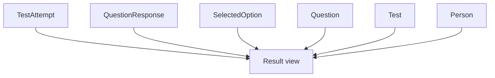

# Результаты

## Результат как представление данных

В текущей модели нет отдельной сущности `Result`, которая бы полностью дублировала состояние прохождения. Источник результата:



`TestAttempt` хранит общий score и времена, а детализация корректности и awarded points находится в `QuestionResponse`.

## Студенческий read model

Студент получает только собственные результаты. Контекст строится от текущего аутентифицированного пользователя к его Person и доступным попыткам.

Frontend дополнительно ограничивает выбор текущим набором результатов, однако безопасность должна обеспечиваться backend.

## Преподавательский/admin read model

Для преподавателя/администратора результаты агрегируются в фильтруемом контексте:

```text
Subject
 -> Lecture
 -> Test
 -> Group
 -> Student
 -> Attempt / answers
```

Преподаватель ограничивается объектами, доступными через его предметные/учебные назначения. Администратор имеет расширенный обзор.

## Correctness и баллы

Для каждого ответа могут быть доступны:

- `IsCorrect`;
- `AwardedPoints`;
- выбранные options;
- текст ответа;
- состояние partial для текстового оценивания в response DTO.

Итоговый score попытки является серверным значением.

## Лучший результат

Frontend может вычислять/показывать лучший результат среди доступных попыток, однако исходные score поступают с backend.

## Изменяемость исторических данных

Поскольку response ссылается на Question, изменение вопроса после прохождения потенциально влияет на то, какие текущие метаданные вопроса доступны при построении детализации. При требованиях к строгой исторической неизменности полезно хранить snapshot текста/вариантов вопроса внутри attempt-response модели. Это относится к возможному дальнейшему развитию и должно оцениваться отдельно от текущего рабочего контракта.
