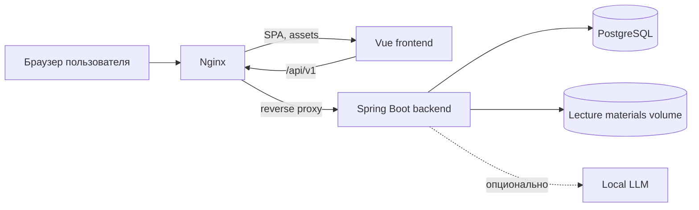
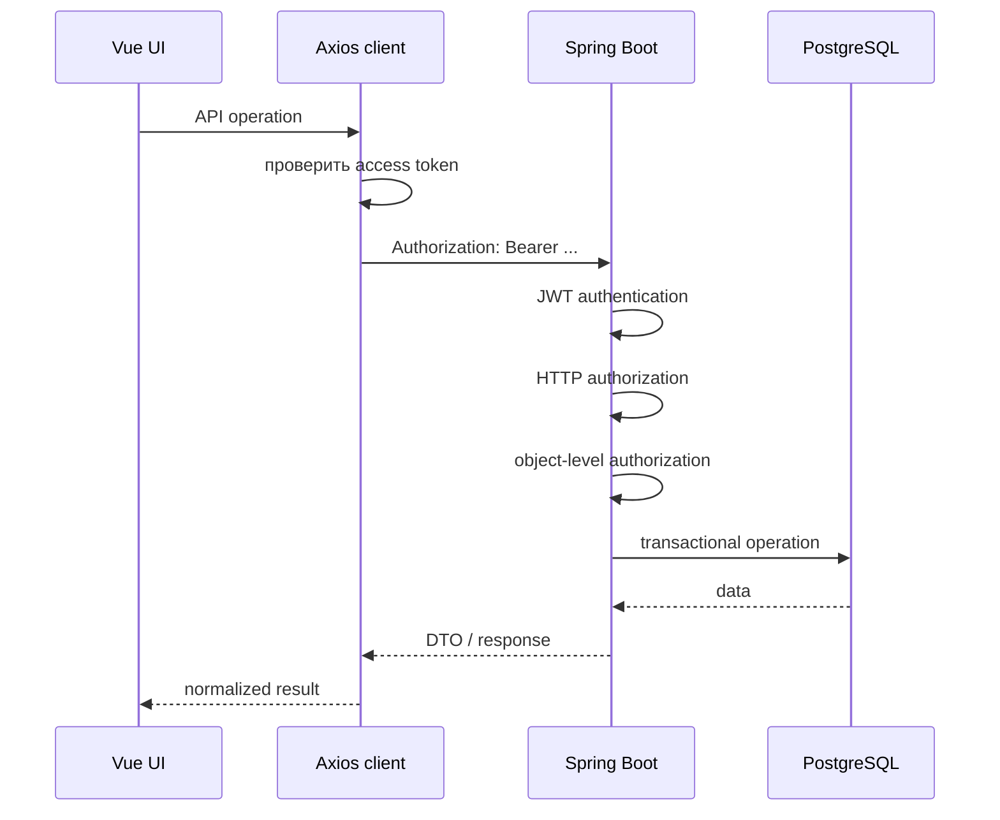
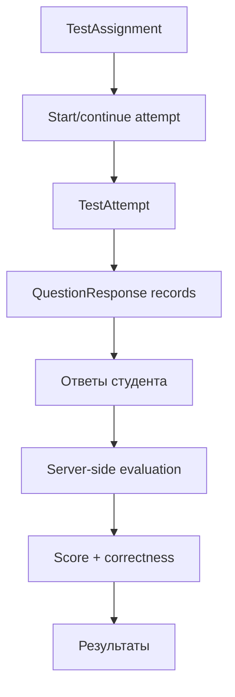
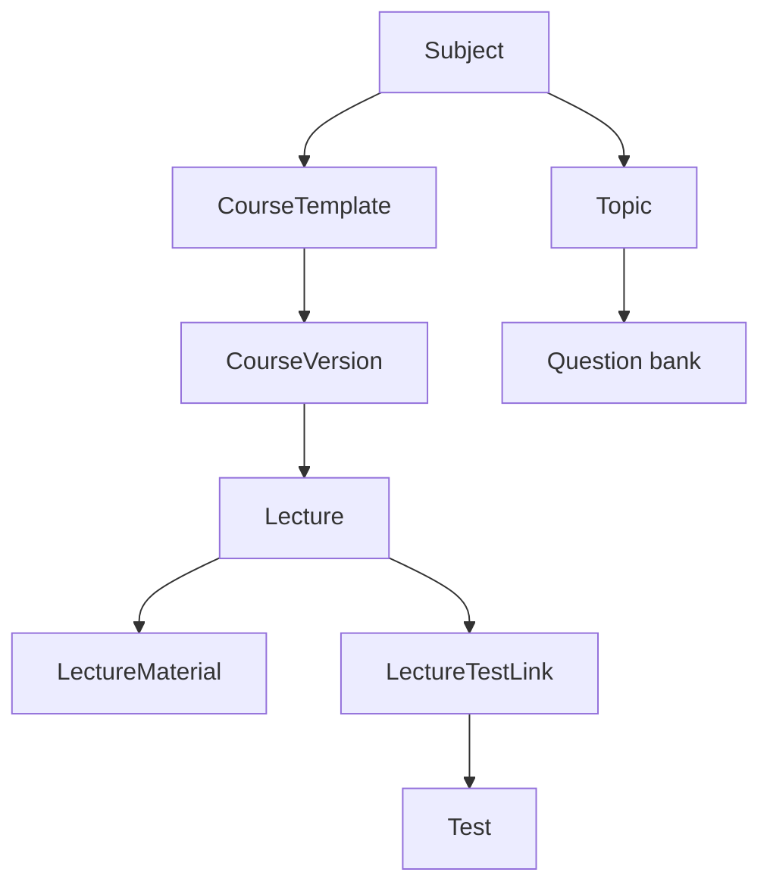

# Архитектура системы

## Назначение документа

Student Testing реализован как клиент-серверное веб-приложение. Frontend отвечает за пользовательский интерфейс и координацию пользовательских сценариев, backend является источником бизнес-правил и данных, PostgreSQL хранит постоянное состояние, а бинарные материалы лекций находятся в файловом хранилище.

## Основные компоненты

| Компонент | Технология | Ответственность |
|---|---|---|
| Frontend | Vue 3, Vite, Pinia, Vue Router, Axios | SPA, навигация, формы, локальное состояние, клиентская оркестрация сценариев |
| UI-слой | PrimeVue + собственные `Ui*` компоненты | Единое представление компонентов, темы, адаптивность |
| Backend | Spring Boot 3.4.3, Java 17 | REST API, бизнес-логика, безопасность, транзакции, файловые операции |
| ORM | Spring Data JPA / Hibernate | Отображение доменной модели в PostgreSQL |
| БД | PostgreSQL 16 | Пользователи, академические данные, тесты, попытки и результаты |
| Файловое хранилище | локальная директория / Docker volume | Материалы лекций |
| Reverse proxy | Nginx | Раздача SPA и проксирование `/api/**` на backend |
| LLM, опционально | локальный HTTP endpoint | Дополнительное оценивание текстовых ответов |

## Runtime-схема

В production frontend является набором статических файлов. Nginx обслуживает SPA и передаёт API-запросы backend-сервису.

## Логическая граница frontend/backend

Frontend не должен быть источником истины для критичных учебных данных. Он может:

- скрывать или показывать действия;
- валидировать формы до отправки;
- восстанавливать локальный черновик;
- управлять переходами и фильтрами;
- повторять запрос после обновления access token.

Backend обязан повторно проверить:

- идентичность пользователя;
- роль и permission;
- принадлежность ресурса преподавателю или студенту;
- доступность тестового назначения;
- лимит попыток;
- корректность набора вопросов;
- итоговый балл.

Таким образом, клиентская проверка улучшает UX, но не заменяет серверную авторизацию и бизнес-валидацию.

## Основные потоки

### Аутентифицированный запрос

### Прохождение теста

### Учебный контент

## Среды выполнения

### Docker/production-подобный режим

- PostgreSQL запускается отдельным контейнером;
- backend работает на внутреннем `8080`;
- frontend работает через Nginx на `80`;
- `/api/` проксируется Nginx на backend;
- данные PostgreSQL и материалы лекций размещаются в отдельных volumes.

### Локальная frontend-разработка

Vite запускает dev server и может проксировать `/api`. Текущий `vite.config.js` требует отдельного внимания к порту backend; это зафиксировано в [технических ограничениях](./technical-limitations.md).

## Архитектурные принципы текущей реализации

1. **Backend-authoritative** для безопасности, тестовых попыток и оценивания.
2. **Stateless HTTP authentication** для API на основе JWT.
3. **Разделение учётной записи и академического Person**.
4. **Двухуровневая авторизация**: общий доступ + доступ к конкретному объекту.
5. **Feature-oriented frontend logic** через composables и API-модули.
6. **Отдельное файловое хранилище** для бинарных материалов.
7. **Сохранение истории membership/assignment** через статусы вместо безусловного физического удаления там, где это предусмотрено моделью.
8. **Защита от конкурентного старта попыток** на уровне транзакции и БД.

## Что не входит в этот документ

Полный перечень endpoint'ов должен находиться в `docs/api/`, команды запуска — в `docs/deployment/`, а стратегия тестирования — в `docs/testing/`.
