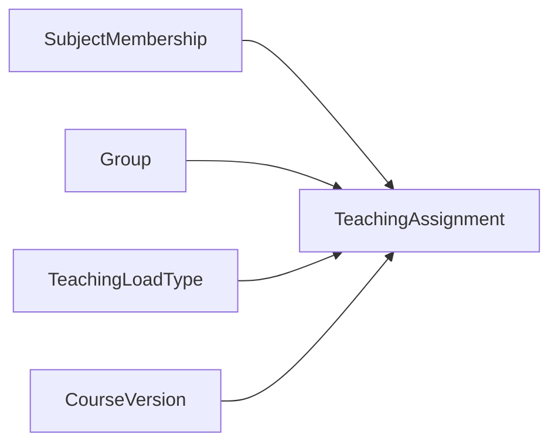
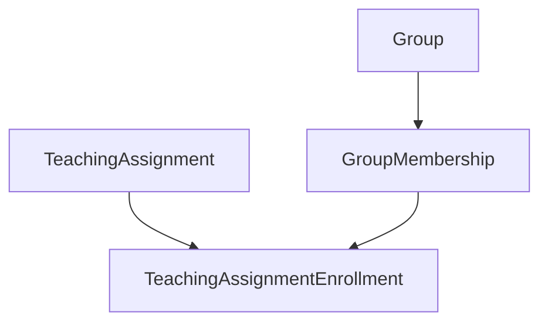

# Учебная нагрузка

## Назначение

Teaching domain связывает преподавателя, предмет и группу в конкретном учебном периоде. Именно эта модель определяет, в каком контексте преподаватель ведёт предмет и каким студентам затем могут назначаться учебные активности.

## `TeachingAssignment`

Основные поля:

- `SubjectMembershipId`;
- `GroupId`;
- `LoadTypeId`;
- optional `CourseVersionId`;
- semester;
- study course;
- academic year;
- hours per week;
- status;
- notes.

## `TeachingLoadType`

Отдельный справочник типов нагрузки. Он позволяет не жёстко зашивать в код названия вроде «лекция», «практика», «лабораторная».

## `SubjectMembershipLoadType`

Позволяет связать membership преподавателя по предмету с допустимыми/назначенными типами нагрузки.

## Enrollment студентов

`TeachingAssignmentEnrollment` связывает:

- `TeachingAssignment`;
- `GroupMembership`;
- `Group`.

Тем самым система может зафиксировать состав студентов внутри конкретного преподавательского назначения, а не только динамически смотреть текущий состав группы.

## Связь с тестами

`TestAssignment` может ссылаться на `TeachingAssignment`. Это даёт тесту конкретный учебный контекст и позволяет определить, кому доступно прохождение.

## Связь с курсом

`TeachingAssignment` может ссылаться на `CourseVersion`, фиксируя версию учебного курса, используемую в конкретном назначении.

## Доступ преподавателя

Преподаватель работает не со всеми предметами системы, а с предметами/контекстами, которые ему назначены. Object-level authorization использует эти связи для ограничения CRUD учебного контента и просмотра результатов.

## Состояния и история

Teaching assignment содержит статус вместо модели, предполагающей обязательное физическое удаление записи. Конкретные отображаемые названия статусов определяются прикладным слоем/UI и будут перечислены в справочной документации.
