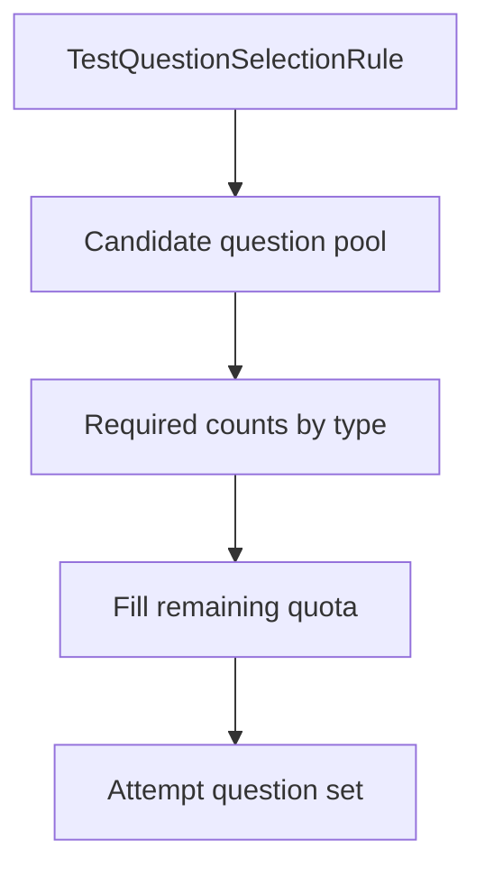

# Тестирование

## Центральная модель

Тестовый домен разделяет четыре понятия:

```text
Question bank  -> из чего можно выбрать
Test           -> правила и параметры теста
TestAssignment -> кому/где/когда тест доступен
TestAttempt    -> конкретное прохождение студентом
```

Смешивать эти сущности нельзя: каждая отвечает за отдельный этап жизненного цикла.

## Вопросы

`Question` (`TestQuestions`) поддерживает четыре типа:

| Код | Тип |
|---:|---|
| 1 | single choice |
| 2 | multiple choice |
| 3 | matching |
| 4 | text |

Общие поля:

- context (`TestId`, `CourseLectureId`, `TopicId`);
- `Type`;
- текст вопроса;
- points;
- ordinal;
- correct answer для соответствующих типов;
- active flag.

`QuestionOption` содержит варианты для option-based вопросов. Matching использует согласованный формат пар, а текстовый тип — `CorrectAnswer`.

## `Test`

Содержит:

- title;
- description;
- duration;
- attempts allowed;
- question count;
- author Person.

Поле `Duration` существует в модели, однако server-authoritative deadline попытки сейчас не реализован полностью — см. ограничения.

## Правила выбора вопросов

`TestQuestionSelectionRule` задаёт:

- контекст Topic или Lecture;
- общее `QuestionCount`;
- количество single/multiple/matching/text;
- ordinal.

При создании попытки `TestService` выбирает требуемые активные вопросы и дополняет оставшуюся квоту из разрешённого пула.



## Назначение теста

`TestAssignment` содержит:

- `TestId`;
- scope;
- optional CourseVersion;
- optional Lecture;
- optional TeachingAssignment;
- `AvailableFromUtc`;
- `AvailableUntilUtc`;
- status.

Это объект доступности, а не сам тест.

## Начало попытки

Для студента корректный поток идёт через public learning API и assignment.

При начале backend должен проверить:

1. аутентификацию;
2. наличие Person;
3. принадлежность к учебному назначению;
4. статус и временное окно TestAssignment;
5. лимит попыток;
6. наличие/валидность вопросов;
7. отсутствие другой активной попытки.

## Конкурентный старт

Критичные записи блокируются pessimistic lock. Дополнительно в PostgreSQL есть уникальное ограничение на одну активную попытку для пары assignment/person.

Таким образом race condition защищён двумя слоями:

```text
transaction lock
+
database uniqueness
```

## Лимит попыток

Фактическая серверная логика считает использованные попытки по Student/Person и Test. Поэтому лимит относится к тесту для пользователя и может охватывать несколько assignment одного Test.

Это важная бизнес-семантика и должна учитываться при дальнейшем изменении модели назначений.

## Фиксация набора вопросов

После выбора вопросов для попытки создаются `QuestionResponse`. Благодаря этому конкретная попытка имеет зафиксированный набор, даже если банк вопросов позднее изменится.

## Отправка ответов

Ответы записываются в `QuestionResponse` и `SelectedOption`. Итоговая проверка выполняется backend.

Frontend не должен самостоятельно начислять итоговый score.

## Оценивание

Для option/matching/text типов `TestService` определяет correctness и awarded points. Текстовые ответы делегируются `TextAnswerEvaluationService`.

## Завершение

После оценки попытка получает completed state, `CompletedAt` и итоговый `Score`. Результаты затем строятся из попытки и responses.

## Клиентский черновик

`sessionStorage` на frontend сохраняет ответы для UX-восстановления, но не является серверной фиксацией попытки. Детали — в [frontend-state-and-lifecycle.md](./frontend-state-and-lifecycle.md).
