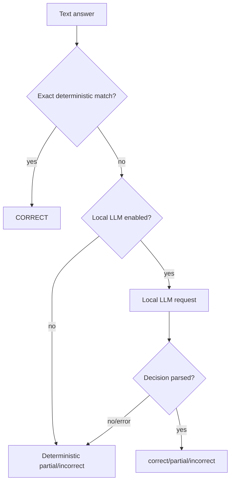

# Оценивание текстовых ответов

## Абстракция

Тестовый сервис не зашивает единственный способ проверки текстового ответа. Он использует интерфейс `TextAnswerEvaluationService`.

Основные реализации:

- `DefaultTextAnswerEvaluationService`;
- `LocalLlmTextAnswerEvaluationService`.

## Детерминированная проверка

`DefaultTextAnswerEvaluationService` использует `TextAnswerEvaluator` и возвращает:

- `CORRECT`;
- `PARTIALLY_CORRECT`;
- `INCORRECT`.

Проверка выполняет нормализацию и сравнение с допустимыми текстовыми вариантами ответа.

Этот вариант является предсказуемым и не требует внешнего сервиса.

## Локальный LLM

Опциональная конфигурация:

```text
APP_TEXT_ANSWER_LOCAL_LLM_ENABLED
APP_TEXT_ANSWER_LOCAL_LLM_ENDPOINT
APP_TEXT_ANSWER_LOCAL_LLM_MODEL
APP_TEXT_ANSWER_LOCAL_LLM_TIMEOUT_SECONDS
```

Default endpoint:

```text
http://127.0.0.1:11434/api/generate
```

## Ограничение endpoint

`LocalLlmTextAnswerEvaluationService` разрешает только локальные host:

- `localhost`;
- `127.0.0.1`;
- `::1` и loopback equivalent.

Endpoint должен быть абсолютным HTTP URI. Это ограничивает SSRF-поверхность конфигурации и подчёркивает, что функция рассчитана на локальную модель.

## Поток оценивания



## Fallback

При ошибке LLM приложение не должно терять возможность завершить тест. Сервис использует локальную deterministic evaluation как fallback.

## Синхронность

LLM-вызов выполняется синхронно в процессе серверного оценивания submit. Поэтому включённая модель может увеличить latency завершения теста до configured timeout.

Для больших нагрузок возможное развитие — вынести semantic grading в асинхронный pipeline, однако это потребует изменения модели результата и пользовательского UX.

## Источник истины

Даже при LLM evaluation окончательное значение correctness/points фиксирует backend. Frontend не принимает решение о правильности текстового ответа.
